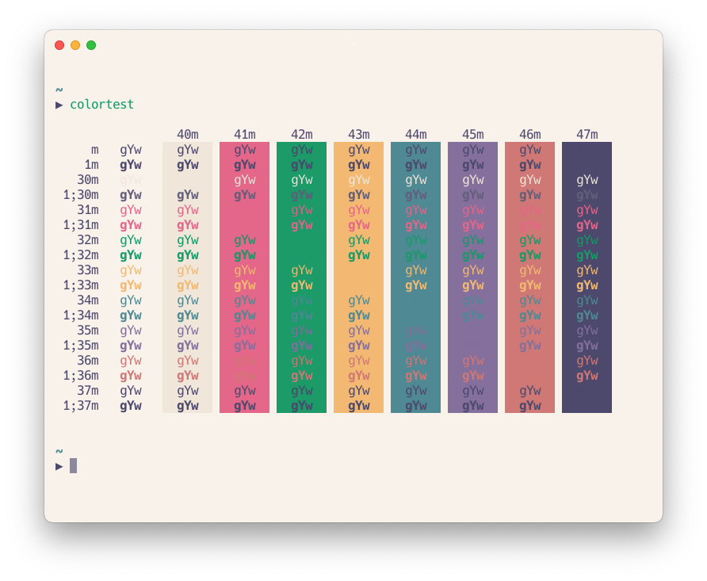
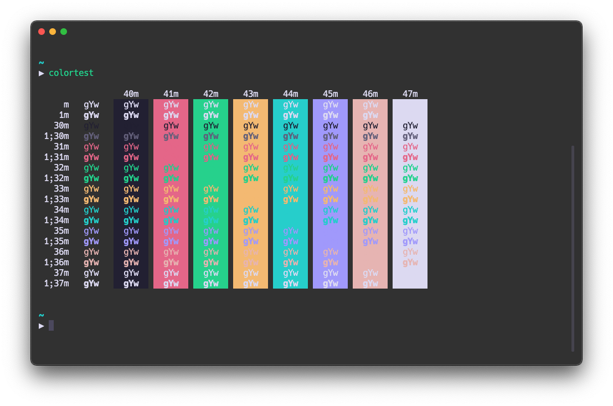

# Smooth

My interpretation of a comfortable color theme to use with Hyper. This work is based on the work from the guys at [Rosé Pine](https://github.com/rose-pine/hyper) and [ng-hai](https://github.com/ng-hai/hyper-rose-pine-next) that provided a clear example of how a responsive theme can be based on the macOS color scheme.




### Usage

```bash
hyper i hyper-smooth
```

or

```js
module.exports = {
  plugins: ["hyper-smooth"],
};
```

### Configuration

Configuration is fairly straight forward. Assume the following default config.

```json
{
  "smooth": {
    "variant": "dark", // or "light"
    "disableAutomaticTheming": false
  }
}
```

Adjusting `disableAutomaticTheming` may require a full reload.
